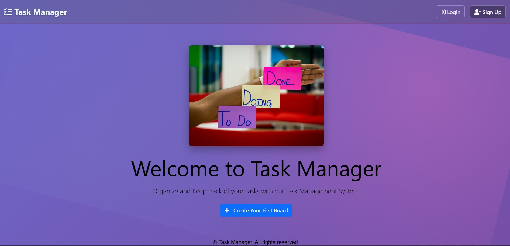
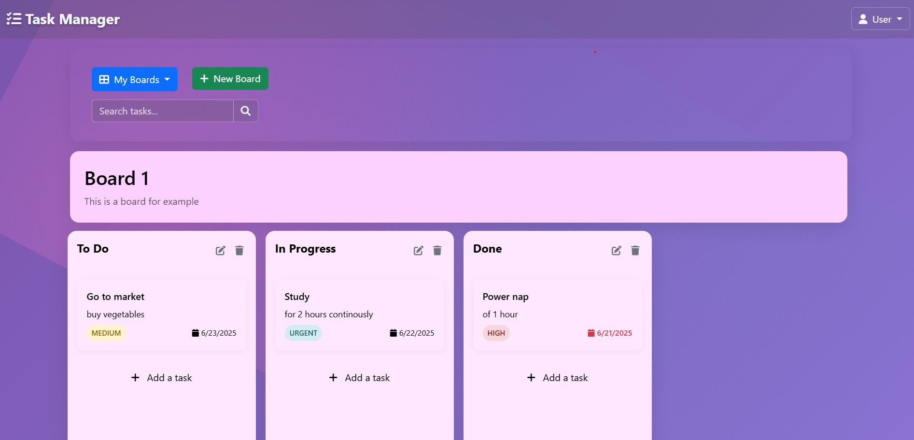

# 📝 Task Manager – Website and Web Application

A **simple, secure, and responsive task management application** — built using **vanilla JavaScript**, **Bootstrap**, and **Firebase Modular SDK**. Users can create boards, add/edit tasks, and move them between columns using intuitive **drag & drop** feature.

👉 [**Live Demo (GitHub Pages)**](https://sanjayp29.github.io/TaskManager/)  
👉 [**Live Demo (Firebase)**](https://taskmanager-29.web.app/)  


## 🚀 Key Features

- 🔐 **User Authentication** (Email/Password using Firebase Auth)
- ✅ **App Check Enabled** via **reCAPTCHA v3** for securing backend
- 🗂️ **Create & Manage Boards**
- 📝 **Add, Edit, and Delete Tasks with Priority and Due Dates**
- 📦 **Drag & Drop Tasks Across Columns** (`To Do`, `In Progress`, `Done`, etc.)
- ☁️ **Firestore Database** for real-time sync
- 📱 **Fully Responsive Design** using Bootstrap
- 🌐 **Hosted on GitHub Pages** (Frontend) 

---

## 🛠️ Tech Stack

| Technology          | Purpose                                      |
|---------------------|----------------------------------------------|
| HTML, CSS, JS       | Frontend logic and layout                    |
| Bootstrap 5         | UI styling and responsive design             |
| Firebase Auth       | User login and signup                        |
| Firebase Firestore  | Database for storing boards/tasks/columns    |
| Firebase App Check  | Secures access to backend with reCAPTCHA v3  |
| GitHub Pages        | Deployment                                   |

---

## 🔐 Firebase App Check Setup

- Enabled **App Check** using **reCAPTCHA v3** to prevent abuse.
- App Check tokens are required for **Firestore access**.
- Ensure your **reCAPTCHA site key** is registered in the Firebase console and initialized like so:

## 🧪 Performance Insights

- ✅ Scored overall **98 on Desktop** using [Google Lighthouse](https://developers.google.com/web/tools/lighthouse)
- 📱 Mobile score: 74 – will improvise in free time.

This ensures smooth and fast experience for desktop users, enhancements will be upcoming for mobile.

```js
import { initializeAppCheck, ReCaptchaV3Provider } from 'firebase/app-check';

const appCheck = initializeAppCheck(app, {
  provider: new ReCaptchaV3Provider('your-public-site-key'),
  isTokenAutoRefreshEnabled: true,
});
```

<br>

